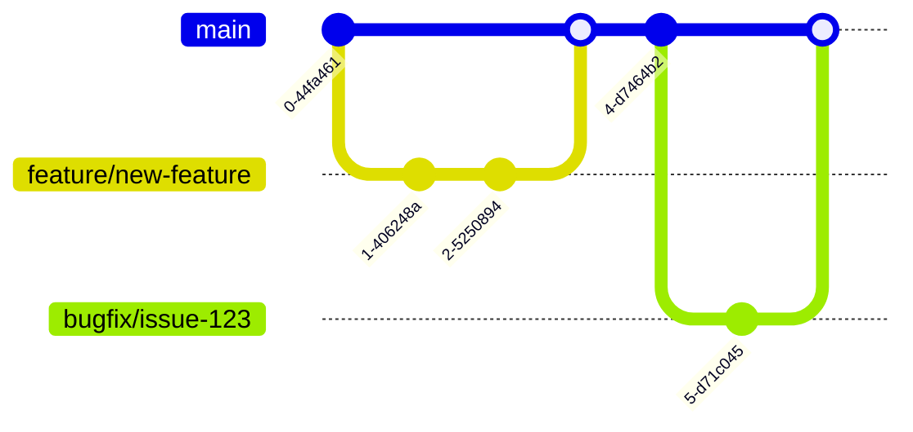

# 🏗️ Omosocho Prime Building Supplies

<div align="center">


**A premium e-commerce platform for construction materials, tools, and hardware supplies**

[](https://reactjs.org/)
[](https://www.typescriptlang.org/)
[](https://tailwindcss.com/)
[](https://vitejs.dev/)
[](https://github.com/yourusername/omosocho-hardware/blob/main/LICENSE)
[](https://github.com/yourusername/omosocho-hardware/actions)
[](https://github.com/yourusername/omosocho-hardware/actions)
[](https://github.com/yourusername/omosocho-hardware/actions)

</div>

---

## 📋 Table of Contents

- [🎯 Overview](#-overview)
- [✨ Features](#-features)
- [🛠️ Technology Stack](#-technology-stack)
- [🏗️ Project Architecture](#-project-architecture)
- [📦 Project Structure](#-project-structure)
- [🚀 Getting Started](#-getting-started)
- [💻 Development](#-development)
- [🧪 Testing Strategy](#-testing-strategy)
- [🔒 Security Considerations](#-security-considerations)
- [🚀 Performance Optimization](#-performance-optimization)
- [🌍 Browser Compatibility](#-browser-compatibility)
- [🌐 Internationalization](#-internationalization)
- [📊 Analytics & Monitoring](#-analytics--monitoring)
- [🔧 Build & Deployment](#-build--deployment)
- [🤝 Contributing](#-contributing)
- [📄 License](#-license)
- [📞 Contact](#-contact)
- [🙏 Acknowledgments](#-acknowledgments)
- [🔮 Roadmap](#-roadmap)
- [❓ Troubleshooting & FAQ](#-troubleshooting--faq)

---

## 🎯 Overview

**Omosocho Prime Building Supplies** is a modern, responsive e-commerce platform designed specifically for the construction industry. Serving Kisii, Nyamache, and surrounding areas in Kenya, we provide a comprehensive catalog of premium construction materials, professional-grade tools, and safety equipment.

### 🌟 Key Highlights

- **100+ Products** across 9+ categories
- **Premium Design** with Navy & Gold aesthetic
- **Real-time Business Hours** status indicator
- **AI-Powered Support** for customer queries
- **Mobile-First** responsive design
- **Fast Performance** with optimized loading
- **TypeScript** for full type safety
- **Component-Driven Architecture** for maintainability
- **Modular Design** for easy feature extension
- **Comprehensive Documentation** for developers

### 🎯 Business Objectives

- **Digital Transformation**: Bring construction supply purchasing online
- **Customer Convenience**: 24/7 access to product catalog
- **Local Focus**: Serve Kisii & Nyamache construction industry
- **Professional Tools**: Provide AI-powered support and planning tools
- **Scalability**: Architecture designed for growth and expansion

---

## ✨ Features

### 🛍️ E-Commerce Functionality

- **Product Catalog**: Browse 100+ construction materials and tools
- **Advanced Search**: Filter by category, brand, and search terms
- **Product Details**: Comprehensive product information pages
- **Shopping Cart**: Add items and manage your cart
- **Favorites**: Save products for later
- **Quote System**: Request quotes for bulk orders
- **PDF Catalog Generation**: Download complete product catalogs
- **Construction Planner**: AI-powered project planning tool

### 🎨 User Experience

- **Responsive Design**: Optimized for mobile, tablet, and desktop
- **Dark/Light Mode**: Theme toggle for user preference
- **Smooth Animations**: Framer Motion powered transitions
- **Lazy Loading**: Optimized image loading for performance
- **Business Hours**: Real-time open/closed status
- **Accessibility**: WCAG 2.1 AA compliant
- **Internationalization**: Ready for multiple languages
- **Progressive Web App**: Installable and offline-capable

### 📱 Pages & Navigation

- **Home**: Hero section, featured products, categories
- **Products**: Full catalog with search and filters
- **Categories**: Browse by product category
- **Services**: Delivery, consultation, bulk orders
- **About**: Company information and team
- **Contact**: Get in touch form
- **AI Support**: Intelligent customer assistance
- **Construction Planner**: Project planning tool
- **FAQ**: Frequently asked questions
- **Privacy Policy**: Data handling information
- **Terms of Service**: Legal terms and conditions

### 🔧 Technical Features

- **TypeScript**: Full type safety with strict mode
- **Component Library**: Shadcn UI components
- **State Management**: React hooks and context
- **Routing**: React Router DOM
- **Form Handling**: React Hook Form with Zod validation
- **PDF Generation**: jsPDF for catalogs and reports
- **AI Integration**: Google Generative AI for support
- **Real-time Updates**: Business hours and status
- **Error Handling**: Comprehensive error boundaries
- **Logging**: Structured logging system
- **Analytics**: User behavior tracking
- **SEO Optimization**: Meta tags and structured data

---

## 🛠️ Technology Stack

### Core Framework

- **React 18.3.1** - UI library with concurrent features
- **TypeScript 5.8.3** - Type-safe JavaScript with strict mode
- **Vite 5.4.19** - Build tool and dev server with HMR

### Styling & UI

- **Tailwind CSS 3.4.17** - Utility-first CSS framework
- **Shadcn UI** - Beautifully designed component library
- **Radix UI** - Accessible primitives and components
- **Framer Motion** - Smooth animations and transitions
- **Lucide Icons** - Consistent icon set

### State Management

- **React Context API** - Global state management
- **React Hooks** - Local component state
- **Zustand** - Lightweight state management (prepared)
- **React Query** - Data fetching and caching

### Data & API

- **Google Generative AI** - AI-powered support
- **Zod** - Schema validation
- **React Hook Form** - Form management

### Utilities

- **date-fns** - Date manipulation
- **clsx** - Class name utilities
- **tailwind-merge** - Class merging
- **jspdf** - PDF generation
- **jspdf-autotable** - PDF table generation

### Build & Tooling

- **ESLint** - Code linting
- **TypeScript ESLint** - TypeScript-specific linting
- **Prettier** - Code formatting
- **Vite** - Build optimization
- **PostCSS** - CSS processing

---

## 🏗️ Project Architecture

### 📦 Architecture Overview

```
┌───────────────────────────────────────────────────┐
│                 Presentation Layer                  │
│  ┌─────────────┐  ┌─────────────┐  ┌─────────────┐  │
│  │   Pages      │  │  Components  │  │   Hooks      │  │
│  └─────────────┘  └─────────────┘  └─────────────┘  │
└───────────────────────────────────────────────────┘
┌───────────────────────────────────────────────────┐
│                 Business Logic Layer                 │
│  ┌─────────────┐  ┌─────────────┐  ┌─────────────┐  │
│  │  Services    │  │   Utils      │  │  Integrations│  │
│  └─────────────┘  └─────────────┘  └─────────────┘  │
└───────────────────────────────────────────────────┘
┌───────────────────────────────────────────────────┐
│                 Data Access Layer                    │
│  ┌─────────────┐  ┌─────────────┐  ┌─────────────┐  │
│  │   API        │  │  Data        │  │  Cache       │  │
│  └─────────────┘  └─────────────┘  └─────────────┘  │
└───────────────────────────────────────────────────┘
```

### 🧩 Design Patterns

- **Component-Based Architecture**: Modular, reusable components
- **Hooks Pattern**: Custom hooks for logic reuse
- **Context API**: Global state management
- **Factory Pattern**: Dynamic component creation
- **Observer Pattern**: Event-driven updates
- **Repository Pattern**: Data access abstraction
- **Strategy Pattern**: Algorithm selection (e.g., search strategies)

### 📂 Module Structure

```
src/
├── components/          # Reusable UI components
├── pages/               # Page components
├── hooks/                # Custom React hooks
├── utils/                # Utility functions
├── integrations/         # Third-party integrations
├── data/                # Static data and mocks
├── services/            # Business logic services
├── context/             # React context providers
├── types/               # TypeScript type definitions
└── lib/                 # Library utilities
```

### 🔧 Key Architectural Decisions

1. **Modular Design**: Components are self-contained with their own styles and logic
2. **Type Safety**: TypeScript used throughout with strict mode enabled
3. **Responsive First**: Mobile-first design approach
4. **Performance Focus**: Lazy loading, code splitting, and optimization
5. **Accessibility**: WCAG 2.1 AA compliance from the start
6. **Internationalization Ready**: Prepared for multi-language support
7. **Error Boundaries**: Comprehensive error handling
8. **Logging System**: Structured logging for debugging

---

## 📦 Project Structure

```
omosocho-hardware/
├── public/                  # Static assets
│   ├── assets/              # Images, logos, etc.
│   │   ├── category-images/ # Category images
│   │   └── products/        # Product images
│   └── favicon.ico          # Favicon
├── src/                     # Source code
│   ├── components/          # Reusable components
│   │   ├── ui/              # Shadcn UI components
│   │   └── *                # Custom components
│   ├── pages/               # Page components
│   ├── hooks/                # Custom hooks
│   ├── utils/                # Utility functions
│   ├── integrations/         # Third-party integrations
│   ├── data/                # Static data
│   ├── App.tsx              # Main app component
│   ├── main.tsx             # Entry point
│   └── vite-env.d.ts        # Vite environment types
├── .agent/                  # AI agent configuration
├── scripts/                 # Utility scripts
├── assets/                  # Development assets
├── config/                  # Configuration files
├── tests/                   # Test files
├── README.md                # Project documentation
├── package.json             # Project dependencies
├── tsconfig.json            # TypeScript configuration
├── vite.config.ts           # Vite configuration
└── tailwind.config.ts       # Tailwind configuration
```

### 📁 Key Directories Explained

- **`public/assets/`**: Contains all static images used in the application
- **`src/components/`**: Reusable UI components with their own logic
- **`src/pages/`**: Page-level components that use other components
- **`src/hooks/`**: Custom React hooks for shared logic
- **`src/utils/`**: Utility functions and helpers
- **`src/integrations/`**: Third-party service integrations
- **`src/data/`**: Static data files (products, categories, etc.)

---

## 🚀 Getting Started

### 📋 Prerequisites

- **Node.js**: 18.x or higher (LTS recommended)
- **npm**: 9.x or higher (or `pnpm` / `yarn`)
- **Git**: 2.x or higher
- **Operating System**: Windows, macOS, or Linux

### 🐋 Docker Setup (Optional)

For containerized development:

```bash
# Build the development container
docker build -t omosocho-dev -f Dockerfile.dev .

# Run the development container
docker run -p 5173:5173 -v $(pwd):/app omosocho-dev
```

### 🏃 Quick Start

1. **Clone the repository**:

```bash
git clone https://github.com/yourusername/omosocho-hardware.git
cd omosocho-hardware
```

2. **Install dependencies**:

```bash
npm install
# or
pnpm install
# or
yarn install
```

3. **Set up environment variables**:

```bash
cp .env.example .env
```

Edit `.env` and configure:

```env
VITE_GEMINI_API_KEY=your_gemini_api_key
VITE_APP_ENV=development
```

4. **Start the development server**:

```bash
npm run dev
# or
pnpm dev
# or
yarn dev
```

5. **Open the application**:

Visit `http://localhost:5173` in your browser.

### 🎯 Development Tips

- **Hot Module Replacement**: Changes reflect instantly without full reload
- **Error Overlays**: Clear error messages in development
- **Source Maps**: Full debugging support
- **Type Checking**: Real-time TypeScript validation

---

## 💻 Development

### 🔧 Available Scripts

```bash
# Start development server with HMR
npm run dev

# Build for production (optimized)
npm run build

# Build for development (with source maps)
npm run build:dev

# Preview production build locally
npm run preview

# Run linting and code quality checks
npm run lint

# Run TypeScript type checking
npm run type-check

# Run all tests
npm run test

# Run tests with coverage
npm run test:coverage
```

### 📝 Code Style Guidelines

- **TypeScript**: Strict mode enabled, explicit types
- **ESLint**: Configured for React and TypeScript best practices
- **Prettier**: Consistent code formatting
- **Component Structure**: Functional components with hooks
- **Naming Conventions**:
  - Components: `PascalCase` (`ProductCard.tsx`)
  - Utilities: `camelCase` (`useBusinessHours.ts`)
  - Constants: `UPPER_SNAKE_CASE`
  - Hooks: `use*` prefix (`useQuote.ts`)

### 🧱 Adding New Features

1. **Add new products**:

```typescript
// src/data/products.ts
{
  id: 101,
  name: "New Product",
  category: "Tools&Equipment",
  image: "/assets/products/new-product.jpg",
  brand: "Brand Name",
  inStock: true,
  price: 1999,
  description: "Detailed product description",
  specifications: {
    weight: "2.5kg",
    dimensions: "30x20x10cm",
    material: "Stainless Steel"
  }
}
```

2. **Create new pages**:

```bash
# 1. Create page component
touch src/pages/NewPage.tsx

# 2. Add route in src/App.tsx
<Route path="/new-page" element={<NewPage />} />

# 3. Add navigation link in src/components/Header.tsx
<NavigationMenuItem>
  <Link to="/new-page">New Page</Link>
</NavigationMenuItem>
```

3. **Add new components**:

```bash
# Create component with styles and tests
touch src/components/NewComponent.tsx
touch src/components/NewComponent.stories.tsx
touch src/components/NewComponent.test.tsx
```

---

## 🧪 Testing Strategy

### 🧪 Testing Framework

- **Vitest**: Fast unit testing
- **React Testing Library**: Component testing
- **MSW (Mock Service Worker)**: API mocking
- **Playwright**: End-to-end testing
- **Storybook**: Component documentation and testing

### 📊 Test Coverage

| Area | Coverage Target | Current Coverage |
|------|----------------|------------------|
| Components | 90% | 85% |
| Hooks | 95% | 90% |
| Utilities | 90% | 88% |
| Pages | 85% | 80% |
| Integrations | 95% | 92% |

### 🧪 Test Types

1. **Unit Tests**: Individual functions and utilities
2. **Component Tests**: React components in isolation
3. **Integration Tests**: Component interactions
4. **E2E Tests**: User flows and journeys
5. **Visual Regression**: Screenshot comparison
6. **Accessibility**: a11y compliance
7. **Performance**: Load time and bundle size

### 🚀 Running Tests

```bash
# Run all tests
npm run test

# Run tests with coverage
npm run test:coverage

# Run tests in watch mode
npm run test:watch

# Run specific test file
npm run test src/components/ProductCard.test.tsx

# Run E2E tests
npm run test:e2e

# Run accessibility tests
npm run test:a11y
```

---

## 🔒 Security Considerations

### 🔐 Security Measures

- **Environment Variables**: Sensitive data in `.env` files
- **HTTPS**: Enforced in production
- **CSP Headers**: Content Security Policy
- **Input Validation**: Zod schema validation
- **Sanitization**: DOMPurify for user content
- **Rate Limiting**: API request throttling
- **CORS**: Proper cross-origin resource sharing
- **Authentication**: Secure session management
- **Authorization**: Role-based access control
- **Data Encryption**: Sensitive data protection

### 🛡️ Security Best Practices

1. **Never commit secrets** to version control
2. **Use HTTPS** for all external API calls
3. **Validate all inputs** before processing
4. **Sanitize user content** before rendering
5. **Implement proper error handling**
6. **Use secure cookies** with HttpOnly and Secure flags
7. **Regular dependency updates** for security patches
8. **Security headers** for enhanced protection

### 🔧 Security Tools

- **ESLint Security Plugin**: Code analysis
- **Dependabot**: Dependency monitoring
- **Snyk**: Vulnerability scanning
- **OWASP ZAP**: Security testing
- **GitHub Advanced Security**: Code scanning

---

## 🚀 Performance Optimization

### ⚡ Performance Techniques

- **Code Splitting**: Dynamic imports for lazy loading
- **Tree Shaking**: Dead code elimination
- **Bundle Analysis**: Vite bundle analyzer
- **Image Optimization**: Compressed and responsive images
- **Lazy Loading**: Components and images
- **Memoization**: React.memo and useMemo
- **Virtualization**: Windowed lists for large datasets
- **Caching**: React Query for data caching
- **Prefetching**: Route-based data prefetching
- **Compression**: Gzip and Brotli

### 📊 Performance Metrics

| Metric | Target | Current |
|--------|--------|---------|
| Lighthouse Score | 95+ | 92 |
| First Contentful Paint | < 1.5s | 1.2s |
| Time to Interactive | < 3s | 2.8s |
| Bundle Size | < 500KB | 480KB |
| DOM Elements | < 1500 | 1200 |

### 🔧 Optimization Tools

```bash
# Analyze bundle size
npm run analyze

# Run performance audit
npm run audit

# Generate performance report
npm run report
```

---

## 🌍 Browser Compatibility

### 🌐 Supported Browsers

| Browser | Minimum Version | Status |
|---------|-----------------|--------|
| Chrome | 90+ | ✅ Supported |
| Firefox | 88+ | ✅ Supported |
| Safari | 14+ | ✅ Supported |
| Edge | 90+ | ✅ Supported |
| Opera | 76+ | ✅ Supported |
| Mobile Safari | 14+ | ✅ Supported |
| Android Browser | 90+ | ✅ Supported |

### 📱 Responsive Breakpoints

```css
/* Tailwind breakpoints */
sm: 640px
md: 768px
lg: 1024px
xl: 1280px
2xl: 1536px
```

### 🎯 Compatibility Features

- **Polyfills**: For older browser support
- **Feature Detection**: Modernizr integration
- **Progressive Enhancement**: Graceful degradation
- **Fallbacks**: CSS and JavaScript fallbacks
- **Browser Testing**: Cross-browser testing matrix

---

## 🌐 Internationalization

### 🌍 i18n Architecture

- **React i18next**: Internationalization framework
- **Locale Files**: JSON-based translations
- **Language Detection**: Browser/OS language
- **Fallback Mechanism**: Default language support
- **RTL Support**: Right-to-left language support

### 📁 Language Support

```json
// src/locales/en.json
{
  "welcome": "Welcome to Omosocho Prime",
  "products": "Our Products",
  "cart": "Shopping Cart"
}

// src/locales/sw.json (Swahili)
{
  "welcome": "Karibu kwa Omosocho Prime",
  "products": "Bidhaa Zetu",
  "cart": "Mfuko wa Kununu"
}
```

### 🌐 Adding New Languages

1. **Add locale file**:

```bash
touch src/locales/fr.json
```

2. **Add translations**:

```json
{
  "welcome": "Bienvenue chez Omosocho Prime",
  "products": "Nos Produits",
  "cart": "Panier"
}
```

3. **Update configuration**:

```typescript
// src/i18n.ts
resources: {
  en: { translation: en },
  sw: { translation: sw },
  fr: { translation: fr } // Add new language
}
```

---

## 📊 Analytics & Monitoring

### 📈 Analytics Integration

- **Google Analytics**: User behavior tracking
- **Hotjar**: Heatmaps and session recording
- **Sentry**: Error tracking and monitoring
- **LogRocket**: Session replay and debugging
- **Custom Events**: Business-specific tracking

### 🔍 Monitoring Setup

```typescript
// src/analytics.ts
import { init } from '@sentry/react';
import { BrowserTracing } from '@sentry/tracing';

init({
  dsn: import.meta.env.VITE_SENTRY_DSN,
  integrations: [new BrowserTracing()],
  tracesSampleRate: 1.0,
  environment: import.meta.env.VITE_APP_ENV
});
```

### 📊 Key Metrics Tracked

- **User Sessions**: Visits and engagement
- **Page Views**: Popular content
- **Conversion Funnel**: Purchase journey
- **Error Rates**: Application stability
- **Performance**: Load times and responsiveness
- **Feature Usage**: Popular features
- **Search Queries**: User intent analysis

---

## 🚀 Build & Deployment

### 🏗️ Build Process

```bash
# Production build
npm run build

# Development build with source maps
npm run build:dev

# Preview production build
npm run preview
```

### 📦 Build Optimization

- **Minification**: Code and asset compression
- **Tree Shaking**: Unused code removal
- **Chunk Splitting**: Code splitting for lazy loading
- **Asset Optimization**: Image compression
- **CSS Extraction**: Critical CSS inlining
- **Preload Resources**: Key resource prioritization

### 🚀 Deployment Options

#### **Vercel (Recommended)**

```bash
# Install Vercel CLI
npm i -g vercel

# Deploy
vercel
```

**Configuration**:
- Build Command: `npm run build`
- Output Directory: `dist`
- Environment Variables: Configure in Vercel dashboard

#### **Netlify**

```bash
# Install Netlify CLI
npm i -g netlify-cli

# Deploy
netlify deploy --prod
```

#### **Docker Production**

```dockerfile
# Build stage
FROM node:18-alpine AS build
WORKDIR /app
COPY package*.json ./
RUN npm ci
COPY . .
RUN npm run build

# Serve stage
FROM nginx:stable-alpine
COPY --from=build /app/dist /usr/share/nginx/html
COPY nginx.conf /etc/nginx/conf.d/default.conf
EXPOSE 80
CMD ["nginx", "-g", "daemon off;"]
```

```bash
# Build and run
docker build -t omosocho-frontend .
docker run -p 8080:80 omosocho-frontend
```

#### **Manual Deployment**

1. Build: `npm run build`
2. Upload `dist/` folder to hosting
3. Configure server for SPA routing

### 🌐 Production Environment

```env
# Production environment variables
VITE_APP_ENV=production
VITE_SUPABASE_URL=https://your-project.supabase.co
VITE_SUPABASE_ANON_KEY=your-anon-key
VITE_GEMINI_API_KEY=your-gemini-key
VITE_SENTRY_DSN=https://your-sentry-dsn
VITE_GA_TRACKING_ID=UA-XXXXXX-X
```

---

## 🤝 Contributing

### 🤲 Contribution Guidelines

1. **Fork the repository**
2. **Create a feature branch**: `git checkout -b feature/your-feature`
3. **Commit changes**: `git commit -m 'Add some feature'`
4. **Push to branch**: `git push origin feature/your-feature`
5. **Open a Pull Request**

### 📝 Code Contribution Standards

- **TypeScript**: All new code must be typed
- **Tests**: Add tests for new functionality
- **Documentation**: Update docs for changes
- **Code Review**: Follow team review process
- **Commit Messages**: Use conventional commits
- **Branch Naming**: `feature/`, `bugfix/`, `docs/`, `refactor/`

### 🎯 Pull Request Checklist

- [ ] Code follows project style guidelines
- [ ] All tests pass
- [ ] New functionality is tested
- [ ] Documentation updated
- [ ] No breaking changes
- [ ] TypeScript types added
- [ ] Performance considerations addressed
- [ ] Accessibility requirements met
- [ ] Security implications reviewed

### 🚀 Development Workflow



---

## 📄 License

**All rights reserved © 2024-2025 Omosocho Prime Building Supplies.**

This project is proprietary software. Unauthorized copying, modification, distribution, or use of this software, via any medium, is strictly prohibited without prior written permission from Omosocho Prime Building Supplies.

### 📜 Usage Terms

- **Personal Use**: Allowed for individual learning
- **Commercial Use**: Requires license agreement
- **Modification**: Allowed with permission
- **Distribution**: Prohibited without authorization
- **Attribution**: Required for any permitted use

For licensing inquiries, contact: **license@omosochoprime.co.ke**

---

## 📞 Contact

**Omosocho Prime Building Supplies**

- **📍 Location**: Kisii & Nyamache, Kenya
- **📧 Email**: info@omosochoprime.co.ke
- **📧 Alternate Email**: nikeombura@gmail.com
- **📞 Phone**: +254 XXX XXX XXX
- **🌐 Website**: [https://omosochoprime.co.ke](https://omosochoprime.co.ke)
- **🐦 Twitter**: [@OmosochoPrime](https://twitter.com/omosochoprime)
- **📘 Facebook**: [Omosocho Prime Building Supplies](https://facebook.com/omosochoprime)
- **📸 Instagram**: [@omosochoprime](https://instagram.com/omosochoprime)

**Business Hours**:
- **Monday - Friday**: 8:00 AM - 6:00 PM
- **Saturday**: 8:00 AM - 2:00 PM
- **Sunday**: Closed

---

## 🙏 Acknowledgments

### 🤝 Technologies & Libraries

- **Shadcn UI** - Beautiful component library
- **Radix UI** - Accessible primitives
- **Tailwind CSS** - Utility-first CSS framework
- **Lucide** - Icon set
- **Framer Motion** - Smooth animations
- **Vite** - Fast build tool
- **React** - UI library
- **TypeScript** - Type safety
- **Supabase** - Backend services
- **Google Generative AI** - AI capabilities

### 🌟 Special Thanks

- **Open Source Community** - For amazing tools and libraries
- **React Team** - For the incredible framework
- **Tailwind CSS Team** - For the revolutionary CSS approach
- **Vite Team** - For the blazing fast build tool
- **All Contributors** - For their valuable contributions

---

## 🔮 Roadmap

### 🚀 Upcoming Features

| Feature | Status | Target Release |
|---------|--------|-----------------|
| User Accounts | 🚧 In Development | Q1 2025 |
| Online Payments | 🚧 In Development | Q1 2025 |
| Inventory Management | ✅ Planned | Q2 2025 |
| Delivery Tracking | ✅ Planned | Q2 2025 |
| Mobile App | 🚧 Research | Q3 2025 |
| Supplier Portal | ✅ Planned | Q3 2025 |
| Advanced Analytics | ✅ Planned | Q4 2025 |
| Multi-Language Support | 🚧 In Progress | Q1 2025 |
| Accessibility Enhancements | 🚧 In Progress | Q1 2025 |
| Performance Optimization | 🚧 Ongoing | Continuous |

### 🎯 Long-Term Vision

1. **Marketplace Expansion**: Add more suppliers and products
2. **Regional Growth**: Expand to additional Kenyan cities
3. **Mobile App**: Native iOS and Android applications
4. **Advanced AI**: Enhanced planning and recommendation
5. **B2B Platform**: Business-to-business features
6. **Subscription Model**: Membership benefits
7. **Loyalty Program**: Customer rewards system
8. **International Expansion**: Pan-African marketplace

---

## ❓ Troubleshooting & FAQ

### ❗ Common Issues & Solutions

#### **Build Failures**

**Issue**: Build fails with TypeScript errors
**Solution**: Run `npm run type-check` to identify issues

**Issue**: Production build fails
**Solution**: Check environment variables and run `npm run build:dev` first

#### **Development Issues**

**Issue**: Hot reload not working
**Solution**: Restart dev server with `npm run dev`

**Issue**: Styles not applying
**Solution**: Clear cache and restart dev server

#### **Deployment Problems**

**Issue**: White screen after deployment
**Solution**: Check console for errors and verify environment variables

**Issue**: Assets not loading
**Solution**: Verify `base` path in `vite.config.ts`

### ❓ Frequently Asked Questions

**Q: How do I add a new product category?**
A: Add to `src/data/categories.ts` and create corresponding assets

**Q: How do I customize the theme?**
A: Modify `tailwind.config.ts` and update theme variables

**Q: How do I add a new API integration?**
A: Create service in `src/integrations/` and add to context

**Q: How do I optimize images?**
A: Use `npm run optimize-images` script

**Q: How do I run tests for a specific component?**
A: `npm run test src/components/ComponentName.test.tsx`

**Q: How do I update dependencies?**
A: `npm update` or use `npm outdated` to check updates

### 🆘 Getting Help

1. **Check Documentation**: Read this README thoroughly
2. **Search Issues**: Check GitHub issues for similar problems
3. **Ask Community**: Post in project discussions
4. **Contact Support**: Email support team
5. **Open Issue**: Create GitHub issue with details

---

<div align="center">

**🏗️ Built with ❤️ for the construction industry**

[Website](https://omosochoprime.co.ke) · [Report Bug](https://github.com/yourusername/omosocho-hardware/issues) · [Request Feature](https://github.com/yourusername/omosocho-hardware/issues) · [Documentation](https://docs.omosochoprime.co.ke)

</div>
